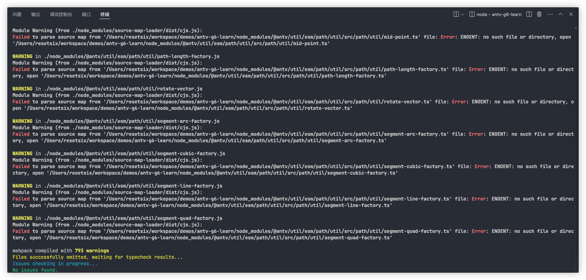
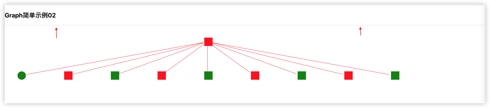
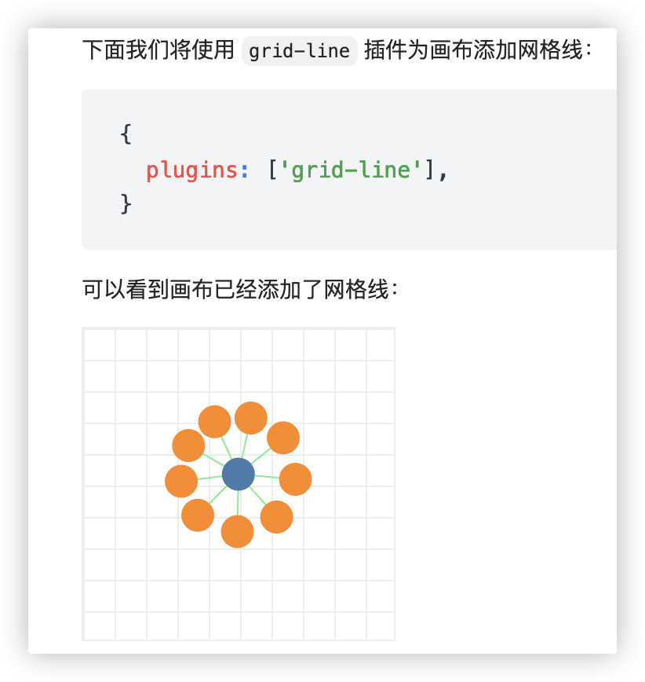

## a repository to learn antv/g6 

antv/g6 v5.0.19

## 遇到问题

### antv/g6 源码映射指向不存在路径


在项目启动编译时提示 warning 信息，不影响项目正常运行



**解决方案**：**关闭**构建工具生成源码映射文件开关  

根目录新增`.env`文件，内容如下
```
GENERATE_SOURCEMAP=false
```

---

### 手动配置色板颜色不生效

色板作用：当 node 数量庞大时，更方便的为 node 配置颜色。

palette会根据`{nodes:[id:xxx,data:{customField:xxx}]}`中的`customField`不同值来区分有几种颜色。

假设`customField: i % 2 === 0 ? "value1" : "value2"`，会返回两个不同的值，那么就会从**自定义的 color 数组**中取出两种颜色（返回什么不重要，只看有几种value。） 

如果数组只有一个颜色，那么所有 node 都是相同的颜色；如果不配置color 数组或为空，则默认使用palette内置颜色。

> 内置颜色有：export type BuiltInPalette = 'spectral' | 'oranges' | 'greens' | 'blues';

```tsx
const graph = new Graph({
    container: "#ID",
    width: number,
    height: number,
    data,
    node: {
      palette: {
        field: "color",
        // good
        color: ["red", "green", "blue"],

        // bad
        // color: 'red'
      },
    },
});
```
**解决方案**：`color`属性传递**数组**

---

### grid-line 插件不生效

```tsx
{
  plugins: ['grid-line'],
}
```



增加以上配置仅仅只增加上图中的横线。预期应该如下



初步判断是使用`autoResize: true`而没有指定`height`影响，但关闭自动画布且配置`height`仍没有效果。

实际原因：容器 <div ref={containerRef} /> 本身没有设置高度，Graph 可能无法正确计算出合适的大小。如果要启用grid-line画布插件，需要给父元素 div 设置宽高，在graph 配置中是无效的。

**解决方案**：给**父容器**设置宽高