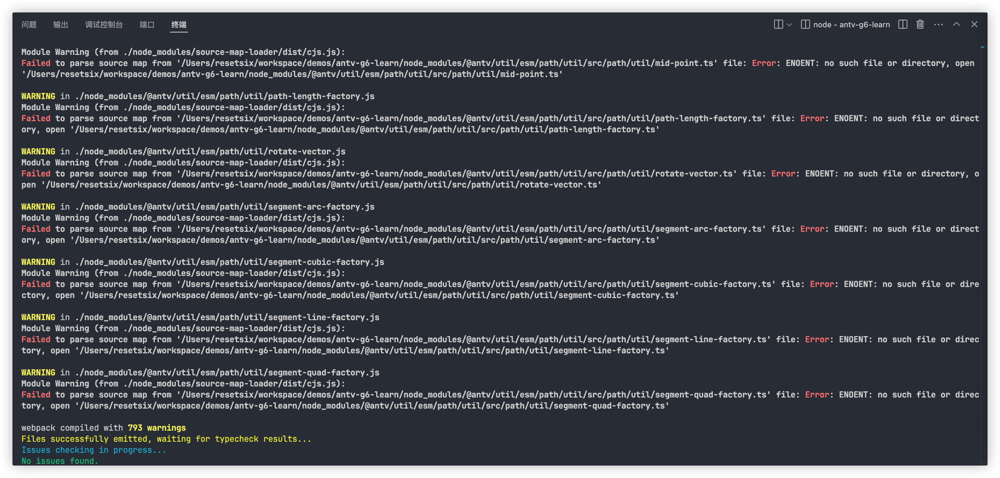
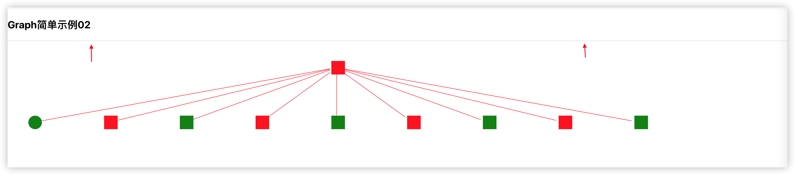
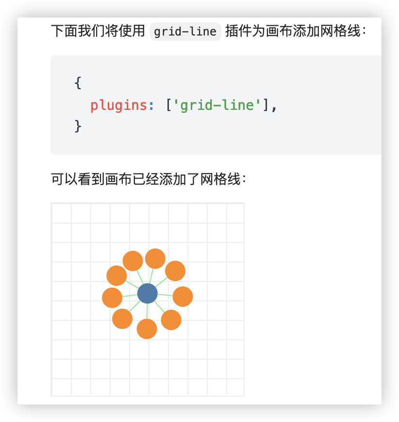
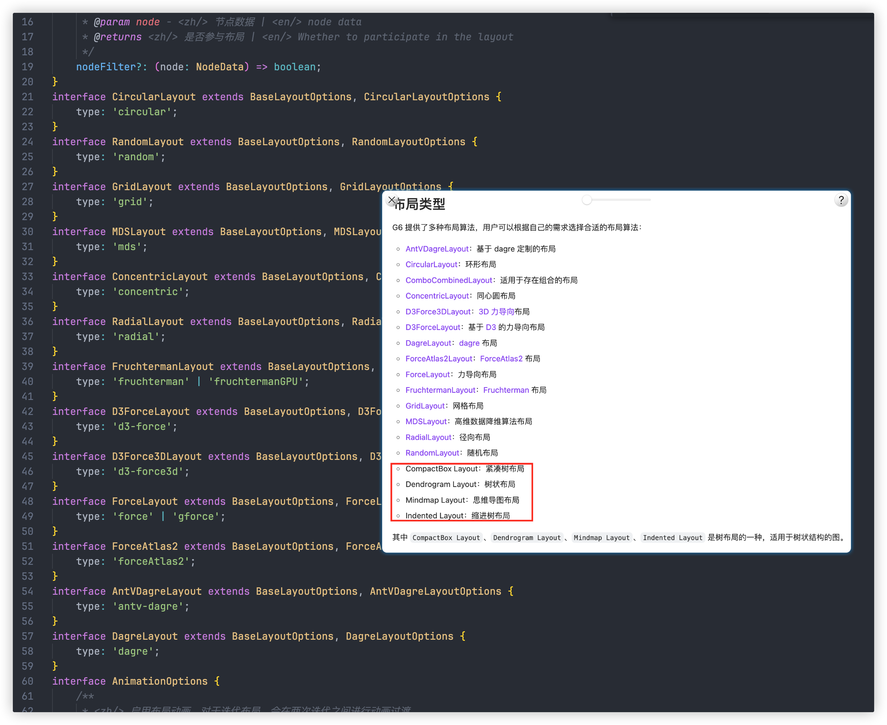
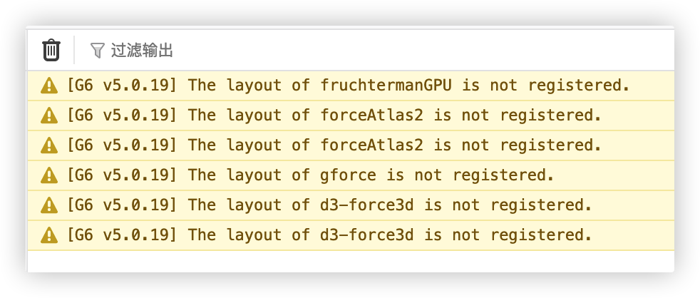
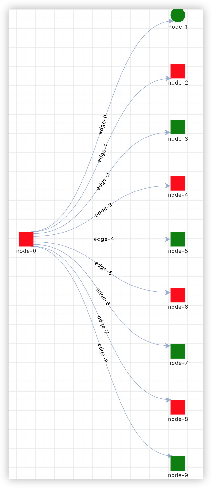
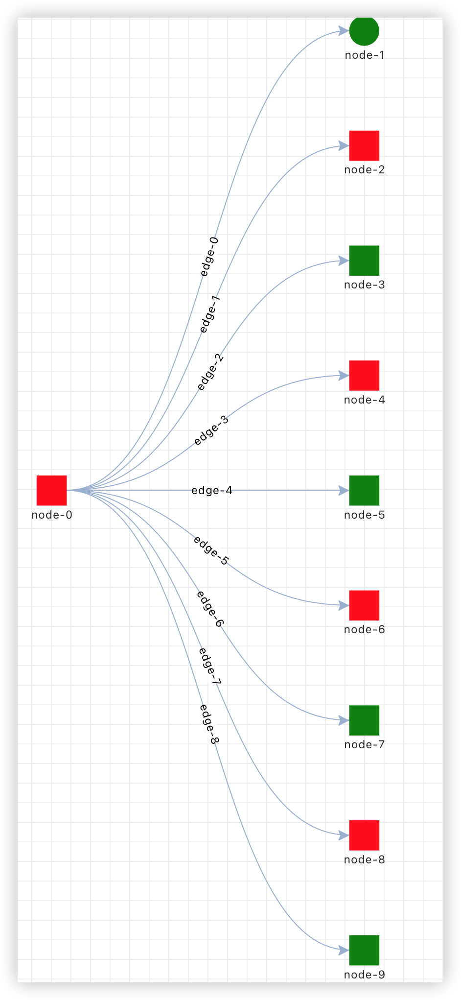

## a repository to learn antv/g6 demo

antv/g6 v5.0.19

## 遇到问题

### antv/g6 源码映射指向不存在路径


在项目启动编译时提示 warning 信息，不影响项目正常运行


<details>
<summary>点击展开/关闭</summary>



</details>  

<br/>

**解决方案**：**关闭**构建工具生成源码映射文件开关  

根目录新增`.env`文件，内容如下
```
GENERATE_SOURCEMAP=false
```

---

### 手动配置色板颜色不生效

色板作用：当 node 数量庞大时，更方便的为 node 配置颜色。

palette会根据`{nodes:[id:xxx,data:{customField:xxx}]}`中的`customField`不同值来区分有几种颜色。

假设`customField: i % 2 === 0 ? "value1" : "value2"`，会返回两个不同的值，那么就会从**自定义的 color 数组**中取出两种颜色（返回什么不重要，只看有几种value。） 

如果数组只有一个颜色，那么所有 node 都是相同的颜色；如果不配置color 数组或为空，则默认使用palette内置颜色。

> 内置颜色有：export type BuiltInPalette = 'spectral' | 'oranges' | 'greens' | 'blues';

```tsx
const graph = new Graph({
    container: "#ID",
    width: number,
    height: number,
    data,
    node: {
      palette: {
        field: "color",
        // right
        color: ["red", "green", "blue"],

        // error
        // color: 'red'
      },
    },
});
```
**解决方案**：`color`属性传递**数组**

---

### grid-line 插件不生效

```tsx
{
  plugins: ['grid-line'],
}
```
<br/>

<details>
<summary>点击展开/关闭</summary>



</details>

<br/>

增加以上配置仅仅只增加上图中的横线。预期应该如下


<details>
<summary>点击展开/关闭</summary>



</details>

<br/>


初步判断是使用`autoResize: true`而没有指定`height`影响，但关闭自动画布且配置`height`仍没有效果。

实际原因：容器`<div ref={containerRef} />`本身没有设置高度，Graph 可能无法正确计算出合适的大小。如果要启用grid-line画布插件，需要给父元素 div 设置宽高，在graph 配置中是无效的。

**解决方案**：给**父容器**设置宽高

### 关于状态样式使用

G6 预设的状态包括：

- selected：选中状态
- active：激活状态
- highlight：高亮状态
- inactive：非激活状态
- disable：禁用状态

G6 中的状态类型是一个字符串数组(string[])，即一个元素可以**同时存在多个状态**，例如一个节点可以同时处于**选中**和**悬停**状态。

可以在`data`中预设 node 的状态。  
可以在**样式映射**中配置状态有哪些样式。

--- 

### 无法使用树图布局

v5合并了图和树图，但是无法使用树图布局。

在layout下的 type 类型声明中也没有树图相关的值。

<details>
<summary>点击展开/关闭</summary>





</details>

<br/>


**解决方案**：从源码跳转到的 Layout TS 类型声明布局名不准确（官方解释说只是用来做内部识别用的），所有内置布局参考 https://github.com/antvis/G6/blob/b49ce81fc1e7ca28d038786b026a4827eccff14f/packages/g6/src/registry/build-in.ts#L188

```
plugin: {
    'bubble-sets': BubbleSets,
    'edge-filter-lens': EdgeFilterLens,
    'grid-line': GridLine,
    background: Background,
    contextmenu: Contextmenu,
    fisheye: Fisheye,
    fullscreen: Fullscreen,
    history: History,
    hull: Hull,
    legend: Legend,
    minimap: Minimap,
    snapline: Snapline,
    timebar: Timebar,
    toolbar: Toolbar,
    tooltip: Tooltip,
    watermark: Watermark,
},
```
---

### tooltip插件启用 enable 后自动移除失效

假设需求：hover或click时只让node有提示，edge没有提示。

```tsx
const graph = new Graph({
  container: xxx,
  plugins: [
    {
      type: "tooltip",
      key: "tooltip",
      // trigger: "click",
      enable: (event: IElementEvent) => {
        return event.targetType === "node" || event.targetType === "edge";
      },
    },
  ],
});
```

### 三次贝塞尔曲线-水平（edge）没有连接在 node 的边缘中心


<details>
<summary>点击展开/关闭</summary>



</details>  

<br/>

修复后效果

<details>
<summary>点击展开/关闭</summary>



</details>

<br/>

**解决方案**：在 node 的**样式对象**中添加如下配置

```tsx
const graph = new Graph({
  container: containerRef.current!,
  node: {
    // ...other
    style: {

      // add these two config 
      port: true,
      ports: [{ placement: "right" }, { placement: "left" }],
    },
  },
  ],
})
```

## 参考
- [Antv-G6学习笔记-v4](https://github.com/puxiao/notes/blob/master/Antv-G6%E5%AD%A6%E4%B9%A0%E7%AC%94%E8%AE%B0.md)  
- [Antv官网-v5](https://g6-next.antv.antgroup.com/)
- [Antv源码-build-in](https://github.com/antvis/G6/blob/v5/packages/g6/src/registry/build-in.ts)